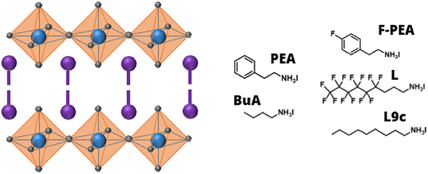

# Solid State	

## PROJECT-1/2D Perovskites	

### The effect of organic molecule on the Stability of the 2D perovskite 

- The formation energy calculation with and without vdW interactions

- Our result :*Hydrogen bond between NH3+ and halogen anions can enhamce the stability of system, while the interactions between other terminus of molecules is deteminig factor in the distance and interaction strength of consequent slabs.*

- Comparing the N-H bond lengths between isolayed molecule and molecule in the perovskite compund indicates there is a significant streching after formation of BuA (), which imply hydrogen bond between Iodines and NH3 functional group. Inspecting the NH bonds carefuly, reveals that there is much more streching (1.050 A) for NH bond directed to the out of plane dangling Iodine, whereas two other NH bonds directed to the in-plane Iodine atoms show smaller change (1.039 A).  

  This can be explained in the terms of different electron distribution over dangling iodine compared with in planes ones.

  

  

  

  

  

   

  - PEABr is an appropriate large organic cation which can reduce dimension of the 3D CsPbBr3 crystal because of stronger hydrogen bond [[6](https://opg.optica.org/ome/fulltext.cfm?uri=ome-10-5-1182&id=429910#ref6)] between the hydrogen atom of PEABr and the bromide atoms compared to the bond between Cs+ and Br−.
  - A small amount of Lewis base, such as water, can readily disrupt the 3D perovskite structure through hydrogen bonding
  - Ruddlesden–Popper (RP),34,35 Dion–Jacobson (DJ)
  - On the other hand, diamine molecules with two amino groups in the DJ phase perovskites can produce hydrogen bonds with the inorganic slabs without any van der Waals gaps, resulting in their enhanced stability. 

  

- Changes in the charge distribution before and after organic molecule  

Considering SOC calculations it can be concluded that there is no significant changes in the stability order after taking SOC into account.

my cif is [myfile](./DATA/CaTiO3_mp-5827_conventional_standard.cif)

## Berry phase 2D Rashba-splitting undewr external field

https://www.nature.com/articles/s41467-018-04014-0

## Termination dependent Dresselhaus-Rashba pattern in perovskite thin films

Here we show ....

## Interfaces between 2D perovskite and Inorganic substrates

- Geometry of interface mismatch ...

